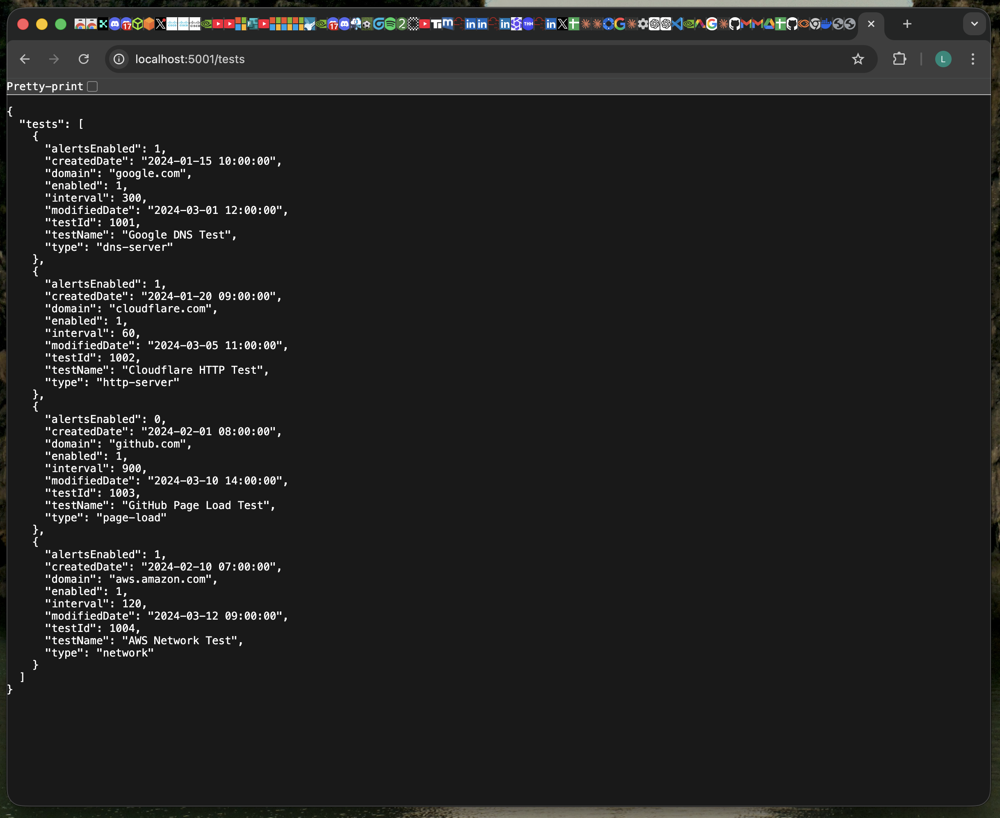
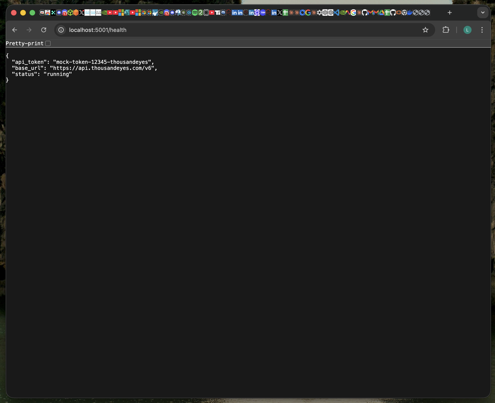

# ThousandEyes Vulnerable Container — Security Research

## Project Overview

This project demonstrates a vulnerable Docker container that simulates 
API calls to the ThousandEyes v6 API. Built for security research and 
educational purposes to showcase common container and API vulnerabilities.

**API Reference:** https://developer.thousandeyes.com/v6/

> Note: ThousandEyes requires a corporate email for trial access.
> The API v6 response format was replicated using official documentation
> to demonstrate real-world API integration and container security concepts.

---

## Project Structure

## Evidence of Successful API Calls

### Home Page

### Tests Endpoint — All ThousandEyes Tests

### Health Endpoint — Exposed API Token (Vulnerability Evidence)

